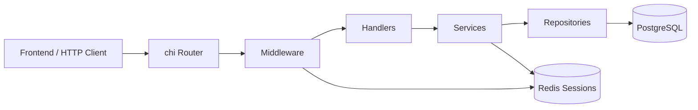

# TrackLink Backend

Backend-часть TrackLink отвечает за HTTP API SaaS-платформы для коротких ссылок. Сервис обрабатывает регистрацию и вход пользователей, управление ссылками, редиректы по короткому коду, сбор событий переходов, базовую аналитику и административную блокировку ссылок.

## Стек

- Go 1.25
- `chi` для HTTP routing
- PostgreSQL через GORM
- Redis через `go-redis`
- `slog` для логирования
- `godotenv` для загрузки `.env`
- Dockerfile для сборки API-сервиса

## Структура проекта

- `cmd/api` - точка входа backend-приложения.
- `internal/app` - загрузка конфигурации, подключение PostgreSQL и Redis, сборка HTTP-сервера.
- `internal/config` - конфигурация из переменных окружения и `.env`.
- `internal/http` - HTTP router и регистрация маршрутов.
- `internal/http/middleware` - middleware для логирования запросов, авторизации и проверки роли администратора.
- `internal/modules` - бизнес-модули backend.
- `internal/platform/db` - подключение к PostgreSQL.
- `internal/platform/redis` - подключение к Redis.
- `internal/platform/logger` - инициализация `slog` logger.
- `internal/platform/session` - хранение сессий в Redis.
- `internal/shared` - общие helpers для контекста и UUID.
- `migrations` - SQL-миграции схемы базы данных.

## Модули

- `accounts` - регистрация, вход, выход и получение текущего пользователя. Работает с PostgreSQL и Redis-сессиями.
- `links` - создание, список, изменение статуса и удаление пользовательских коротких ссылок. Работает с PostgreSQL.
- `redirect` - разрешение короткого кода в целевой URL и фиксация события перехода. Использует репозитории ссылок и аналитики.
- `analytics` - dashboard, аналитика по ссылке и последние переходы. Читает агрегированные данные из PostgreSQL.
- `admin` - административный список ссылок и блокировка ссылки. Доступ ограничен middleware авторизации и роли администратора.

## Схема взаимодействия

