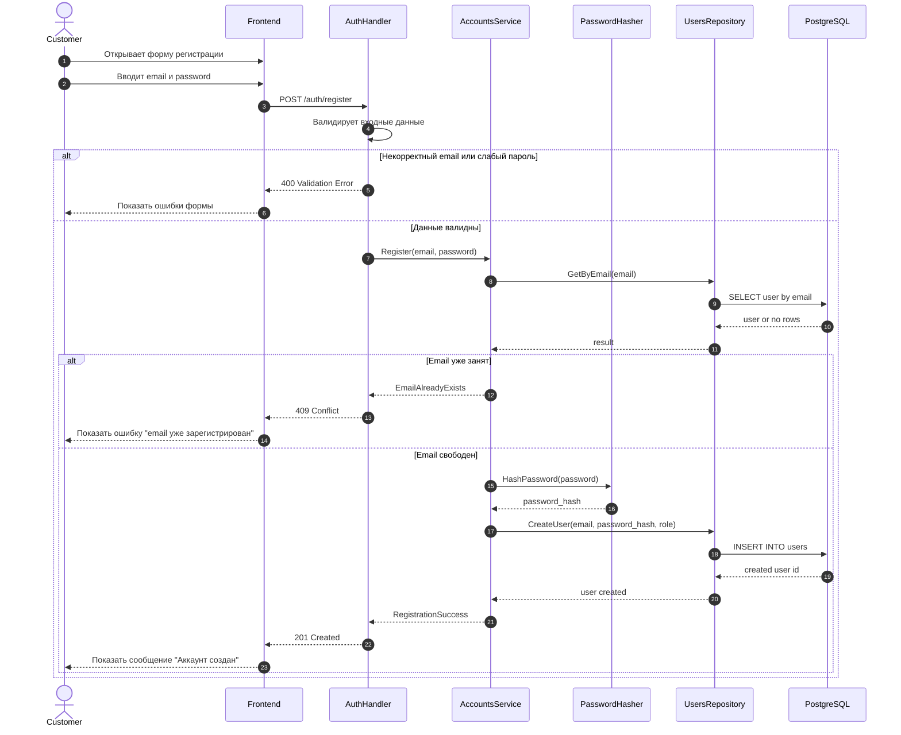

# SD-01 — Регистрация пользователя

```mermaid
sequenceDiagram
    autonumber

    actor Customer
    participant FE as Frontend
    participant AH as AuthHandler
    participant AS as AccountsService
    participant PH as PasswordHasher
    participant UR as UsersRepository
    participant DB as PostgreSQL

    Customer->>FE: Открывает форму регистрации
    Customer->>FE: Вводит email и password
    FE->>AH: POST /auth/register

    AH->>AH: Валидирует входные данные

    alt Некорректный email или слабый пароль
        AH-->>FE: 400 Validation Error
        FE-->>Customer: Показать ошибки формы
    else Данные валидны
        AH->>AS: Register(email, password)

        AS->>UR: GetByEmail(email)
        UR->>DB: SELECT user by email
        DB-->>UR: user or no rows
        UR-->>AS: result

        alt Email уже занят
            AS-->>AH: EmailAlreadyExists
            AH-->>FE: 409 Conflict
            FE-->>Customer: Показать ошибку "email уже зарегистрирован"
        else Email свободен
            AS->>PH: HashPassword(password)
            PH-->>AS: password_hash

            AS->>UR: CreateUser(email, password_hash, role)
            UR->>DB: INSERT INTO users
            DB-->>UR: created user id
            UR-->>AS: user created

            AS-->>AH: RegistrationSuccess
            AH-->>FE: 201 Created
            FE-->>Customer: Показать сообщение "Аккаунт создан"
        end
    end
```