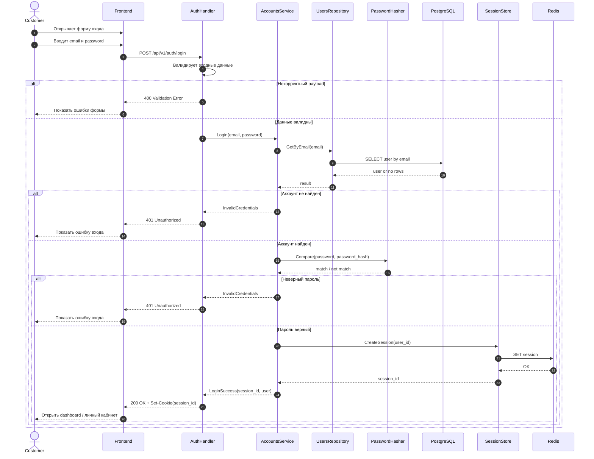

# SD-02 — Вход пользователя

```mermaid
sequenceDiagram
    autonumber

    actor Customer
    participant FE as Frontend
    participant AH as AuthHandler
    participant AS as AccountsService
    participant UR as UsersRepository
    participant PH as PasswordHasher
    participant DB as PostgreSQL
    participant SS as SessionStore
    participant RD as Redis

    Customer->>FE: Открывает форму входа
    Customer->>FE: Вводит email и password
    FE->>AH: POST /api/v1/auth/login

    AH->>AH: Валидирует входные данные

    alt Некорректный payload
        AH-->>FE: 400 Validation Error
        FE-->>Customer: Показать ошибки формы
    else Данные валидны
        AH->>AS: Login(email, password)

        AS->>UR: GetByEmail(email)
        UR->>DB: SELECT user by email
        DB-->>UR: user or no rows
        UR-->>AS: result

        alt Аккаунт не найден
            AS-->>AH: InvalidCredentials
            AH-->>FE: 401 Unauthorized
            FE-->>Customer: Показать ошибку входа
        else Аккаунт найден
            AS->>PH: Compare(password, password_hash)
            PH-->>AS: match / not match

            alt Неверный пароль
                AS-->>AH: InvalidCredentials
                AH-->>FE: 401 Unauthorized
                FE-->>Customer: Показать ошибку входа
            else Пароль верный
                AS->>SS: CreateSession(user_id)
                SS->>RD: SET session
                RD-->>SS: OK
                SS-->>AS: session_id

                AS-->>AH: LoginSuccess(session_id, user)
                AH-->>FE: 200 OK + Set-Cookie(session_id)
                FE-->>Customer: Открыть dashboard / личный кабинет
            end
        end
    end
```