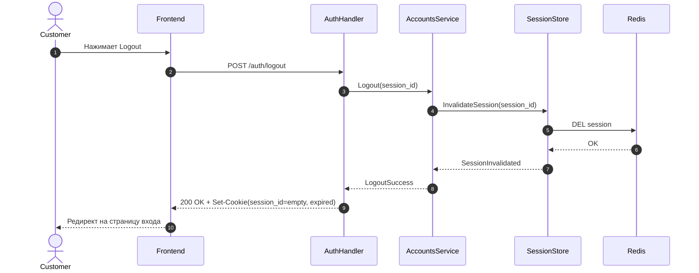

# SD-03 Выход из системы

```mermaid
sequenceDiagram
    autonumber

    actor Customer
    participant FE as Frontend
    participant AH as AuthHandler
    participant AS as AccountsService
    participant SS as SessionStore
    participant RD as Redis

    Customer->>FE: Нажимает Logout
    FE->>AH: POST /auth/logout

    AH->>AS: Logout(session_id)

    AS->>SS: InvalidateSession(session_id)
    SS->>RD: DEL session
    RD-->>SS: OK
    SS-->>AS: SessionInvalidated

    AS-->>AH: LogoutSuccess
    AH-->>FE: 200 OK + Set-Cookie(session_id=empty, expired)
    FE-->>Customer: Редирект на страницу входа
```