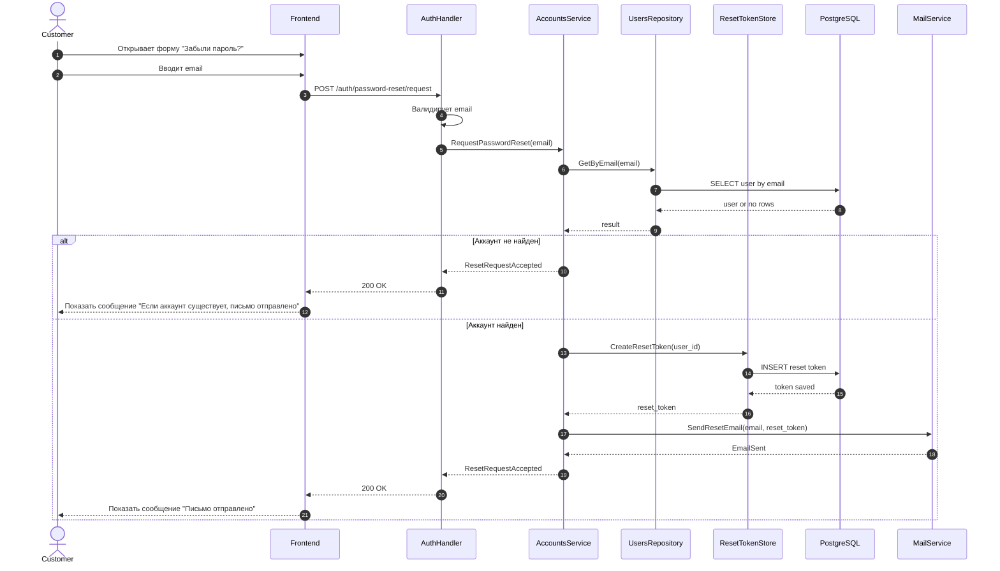

# SD-04 Запрос на восстановление пароля

```mermaid
sequenceDiagram
    autonumber

    actor Customer
    participant FE as Frontend
    participant AH as AuthHandler
    participant AS as AccountsService
    participant UR as UsersRepository
    participant RT as ResetTokenStore
    participant DB as PostgreSQL
    participant MS as MailService

    Customer->>FE: Открывает форму "Забыли пароль?"
    Customer->>FE: Вводит email
    FE->>AH: POST /auth/password-reset/request

    AH->>AH: Валидирует email
    AH->>AS: RequestPasswordReset(email)

    AS->>UR: GetByEmail(email)
    UR->>DB: SELECT user by email
    DB-->>UR: user or no rows
    UR-->>AS: result

    alt Аккаунт не найден
        AS-->>AH: ResetRequestAccepted
        AH-->>FE: 200 OK
        FE-->>Customer: Показать сообщение "Если аккаунт существует, письмо отправлено"
    else Аккаунт найден
        AS->>RT: CreateResetToken(user_id)
        RT->>DB: INSERT reset token
        DB-->>RT: token saved
        RT-->>AS: reset_token

        AS->>MS: SendResetEmail(email, reset_token)
        MS-->>AS: EmailSent

        AS-->>AH: ResetRequestAccepted
        AH-->>FE: 200 OK
        FE-->>Customer: Показать сообщение "Письмо отправлено"
    end
```