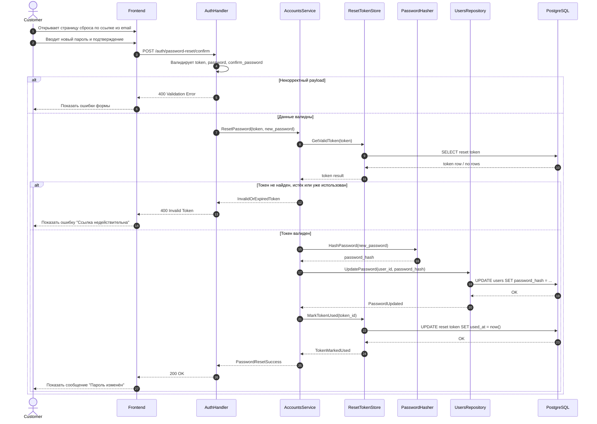

# SD-05 — Сброс пароля по токену

```mermaid
sequenceDiagram
    autonumber

    actor Customer
    participant FE as Frontend
    participant AH as AuthHandler
    participant AS as AccountsService
    participant RT as ResetTokenStore
    participant PH as PasswordHasher
    participant UR as UsersRepository
    participant DB as PostgreSQL

    Customer->>FE: Открывает страницу сброса по ссылке из email
    Customer->>FE: Вводит новый пароль и подтверждение
    FE->>AH: POST /auth/password-reset/confirm

    AH->>AH: Валидирует token, password, confirm_password
    alt Некорректный payload
        AH-->>FE: 400 Validation Error
        FE-->>Customer: Показать ошибки формы
    else Данные валидны
        AH->>AS: ResetPassword(token, new_password)

        AS->>RT: GetValidToken(token)
        RT->>DB: SELECT reset token
        DB-->>RT: token row / no rows
        RT-->>AS: token result

        alt Токен не найден, истёк или уже использован
            AS-->>AH: InvalidOrExpiredToken
            AH-->>FE: 400 Invalid Token
            FE-->>Customer: Показать ошибку "Ссылка недействительна"
        else Токен валиден
            AS->>PH: HashPassword(new_password)
            PH-->>AS: password_hash

            AS->>UR: UpdatePassword(user_id, password_hash)
            UR->>DB: UPDATE users SET password_hash = ...
            DB-->>UR: OK
            UR-->>AS: PasswordUpdated

            AS->>RT: MarkTokenUsed(token_id)
            RT->>DB: UPDATE reset token SET used_at = now()
            DB-->>RT: OK
            RT-->>AS: TokenMarkedUsed

            AS-->>AH: PasswordResetSuccess
            AH-->>FE: 200 OK
            FE-->>Customer: Показать сообщение "Пароль изменён"
        end
    end
```