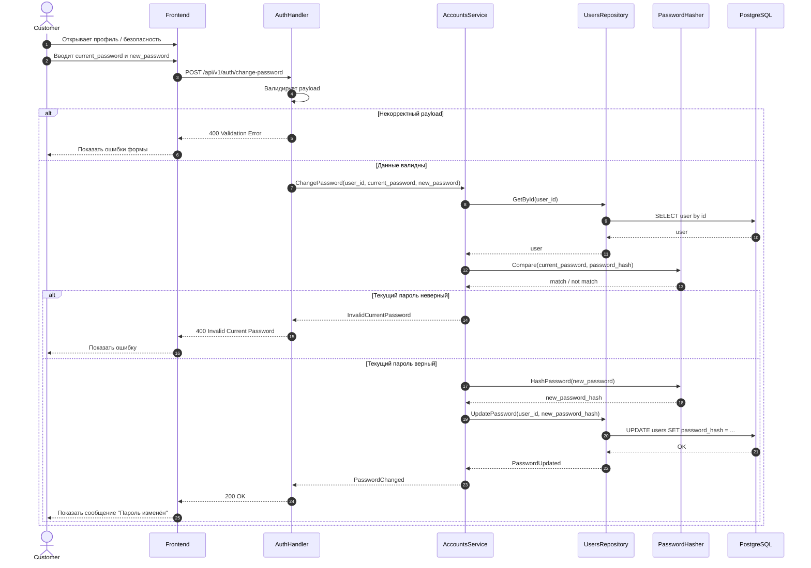

# SD-06 — Изменение пароля

> **Scope: Full version — не входит в MVP**

```mermaid
sequenceDiagram
    autonumber

    actor Customer
    participant FE as Frontend
    participant AH as AuthHandler
    participant AS as AccountsService
    participant UR as UsersRepository
    participant PH as PasswordHasher
    participant DB as PostgreSQL

    Customer->>FE: Открывает профиль / безопасность
    Customer->>FE: Вводит current_password и new_password
    FE->>AH: POST /api/v1/auth/change-password

    AH->>AH: Валидирует payload
    alt Некорректный payload
        AH-->>FE: 400 Validation Error
        FE-->>Customer: Показать ошибки формы
    else Данные валидны
        AH->>AS: ChangePassword(user_id, current_password, new_password)

        AS->>UR: GetById(user_id)
        UR->>DB: SELECT user by id
        DB-->>UR: user
        UR-->>AS: user

        AS->>PH: Compare(current_password, password_hash)
        PH-->>AS: match / not match

        alt Текущий пароль неверный
            AS-->>AH: InvalidCurrentPassword
            AH-->>FE: 400 Invalid Current Password
            FE-->>Customer: Показать ошибку
        else Текущий пароль верный
            AS->>PH: HashPassword(new_password)
            PH-->>AS: new_password_hash

            AS->>UR: UpdatePassword(user_id, new_password_hash)
            UR->>DB: UPDATE users SET password_hash = ...
            DB-->>UR: OK
            UR-->>AS: PasswordUpdated

            AS-->>AH: PasswordChanged
            AH-->>FE: 200 OK
            FE-->>Customer: Показать сообщение "Пароль изменён"
        end
    end
```