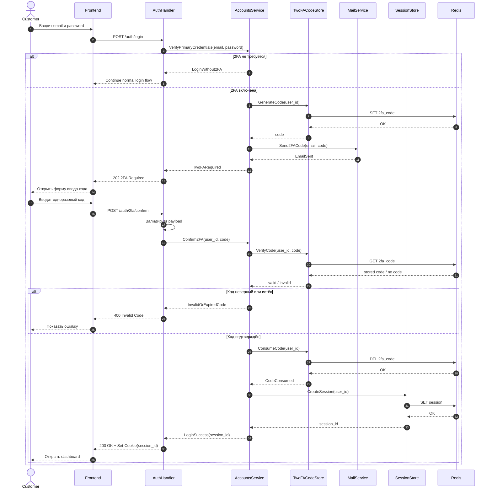

# SD-07 — Подтверждение входа через 2FA

```mermaid
sequenceDiagram
    autonumber

    actor Customer
    participant FE as Frontend
    participant AH as AuthHandler
    participant AS as AccountsService
    participant CS as TwoFACodeStore
    participant MS as MailService
    participant SS as SessionStore
    participant RD as Redis

    Customer->>FE: Вводит email и password
    FE->>AH: POST /auth/login
    AH->>AS: VerifyPrimaryCredentials(email, password)

    alt 2FA не требуется
        AS-->>AH: LoginWithout2FA
        AH-->>FE: Continue normal login flow
    else 2FA включена
        AS->>CS: GenerateCode(user_id)
        CS->>RD: SET 2fa_code
        RD-->>CS: OK
        CS-->>AS: code

        AS->>MS: Send2FACode(email, code)
        MS-->>AS: EmailSent

        AS-->>AH: TwoFARequired
        AH-->>FE: 202 2FA Required
        FE-->>Customer: Открыть форму ввода кода

        Customer->>FE: Вводит одноразовый код
        FE->>AH: POST /auth/2fa/confirm

        AH->>AH: Валидирует payload
        AH->>AS: Confirm2FA(user_id, code)

        AS->>CS: VerifyCode(user_id, code)
        CS->>RD: GET 2fa_code
        RD-->>CS: stored code / no code
        CS-->>AS: valid / invalid

        alt Код неверный или истёк
            AS-->>AH: InvalidOrExpiredCode
            AH-->>FE: 400 Invalid Code
            FE-->>Customer: Показать ошибку
        else Код подтверждён
            AS->>CS: ConsumeCode(user_id)
            CS->>RD: DEL 2fa_code
            RD-->>CS: OK
            CS-->>AS: CodeConsumed

            AS->>SS: CreateSession(user_id)
            SS->>RD: SET session
            RD-->>SS: OK
            SS-->>AS: session_id

            AS-->>AH: LoginSuccess(session_id)
            AH-->>FE: 200 OK + Set-Cookie(session_id)
            FE-->>Customer: Открыть dashboard
        end
    end
```