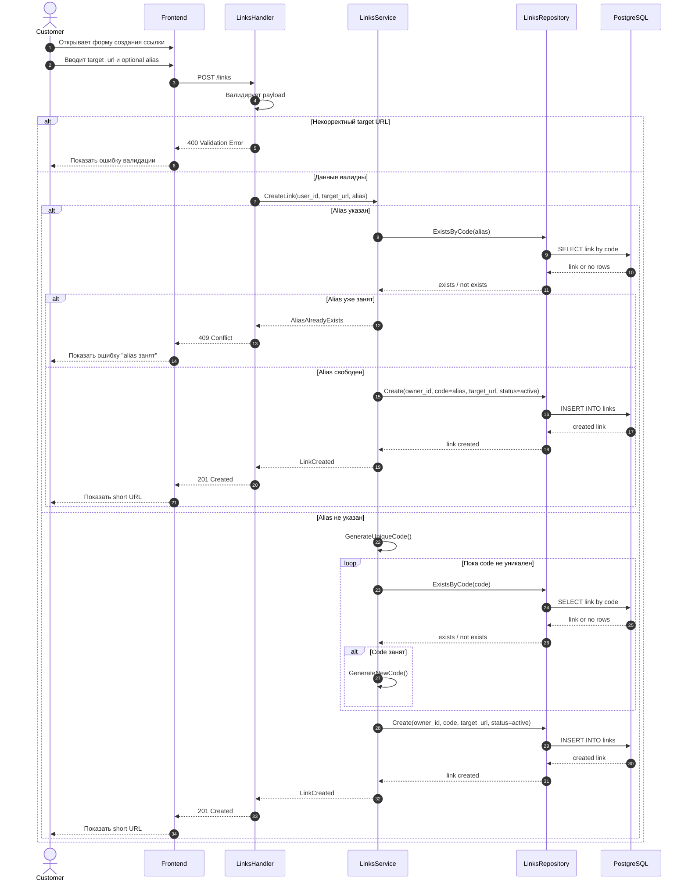

# SD-08 — Создание короткой ссылки

```mermaid
sequenceDiagram
    autonumber

    actor Customer
    participant FE as Frontend
    participant LH as LinksHandler
    participant LS as LinksService
    participant LR as LinksRepository
    participant DB as PostgreSQL

    Customer->>FE: Открывает форму создания ссылки
    Customer->>FE: Вводит target_url и optional alias
    FE->>LH: POST /links

    LH->>LH: Валидирует payload
    alt Некорректный target URL
        LH-->>FE: 400 Validation Error
        FE-->>Customer: Показать ошибку валидации
    else Данные валидны
        LH->>LS: CreateLink(user_id, target_url, alias)

        alt Alias указан
            LS->>LR: ExistsByCode(alias)
            LR->>DB: SELECT link by code
            DB-->>LR: link or no rows
            LR-->>LS: exists / not exists

            alt Alias уже занят
                LS-->>LH: AliasAlreadyExists
                LH-->>FE: 409 Conflict
                FE-->>Customer: Показать ошибку "alias занят"
            else Alias свободен
                LS->>LR: Create(owner_id, code=alias, target_url, status=active)
                LR->>DB: INSERT INTO links
                DB-->>LR: created link
                LR-->>LS: link created

                LS-->>LH: LinkCreated
                LH-->>FE: 201 Created
                FE-->>Customer: Показать short URL
            end
        else Alias не указан
            LS->>LS: GenerateUniqueCode()

            loop Пока code не уникален
                LS->>LR: ExistsByCode(code)
                LR->>DB: SELECT link by code
                DB-->>LR: link or no rows
                LR-->>LS: exists / not exists
                alt Code занят
                    LS->>LS: GenerateNewCode()
                end
            end

            LS->>LR: Create(owner_id, code, target_url, status=active)
            LR->>DB: INSERT INTO links
            DB-->>LR: created link
            LR-->>LS: link created

            LS-->>LH: LinkCreated
            LH-->>FE: 201 Created
            FE-->>Customer: Показать short URL
        end
    end
```

