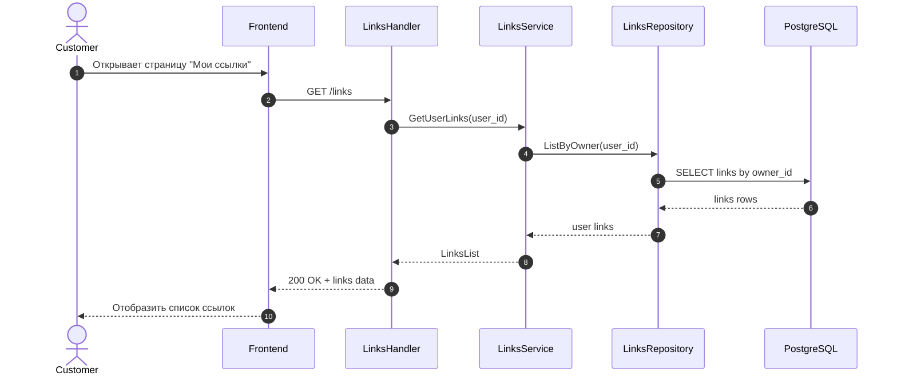

# SD-09 — Получение списка ссылок пользователя

```mermaid
sequenceDiagram
    autonumber

    actor Customer
    participant FE as Frontend
    participant LH as LinksHandler
    participant LS as LinksService
    participant LR as LinksRepository
    participant DB as PostgreSQL

    Customer->>FE: Открывает страницу "Мои ссылки"
    FE->>LH: GET /links

    LH->>LS: GetUserLinks(user_id)

    LS->>LR: ListByOwner(user_id)
    LR->>DB: SELECT links by owner_id
    DB-->>LR: links rows
    LR-->>LS: user links

    LS-->>LH: LinksList
    LH-->>FE: 200 OK + links data
    FE-->>Customer: Отобразить список ссылок
```

