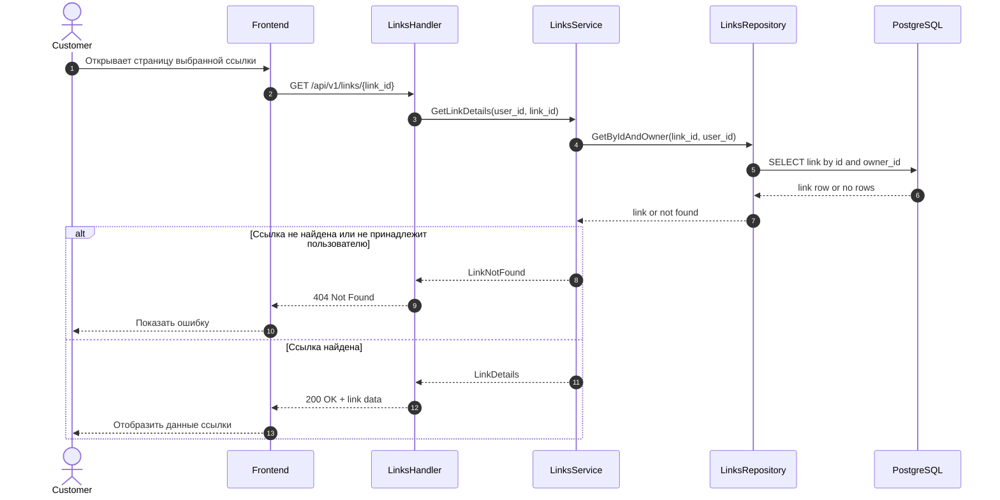

# SD-10 — Получение данных ссылки

```mermaid
sequenceDiagram
    autonumber

    actor Customer
    participant FE as Frontend
    participant LH as LinksHandler
    participant LS as LinksService
    participant LR as LinksRepository
    participant DB as PostgreSQL

    Customer->>FE: Открывает страницу выбранной ссылки
    FE->>LH: GET /api/v1/links/{link_id}

    LH->>LS: GetLinkDetails(user_id, link_id)

    LS->>LR: GetByIdAndOwner(link_id, user_id)
    LR->>DB: SELECT link by id and owner_id
    DB-->>LR: link row or no rows
    LR-->>LS: link or not found

    alt Ссылка не найдена или не принадлежит пользователю
        LS-->>LH: LinkNotFound
        LH-->>FE: 404 Not Found
        FE-->>Customer: Показать ошибку
    else Ссылка найдена
        LS-->>LH: LinkDetails
        LH-->>FE: 200 OK + link data
        FE-->>Customer: Отобразить данные ссылки
    end
```

