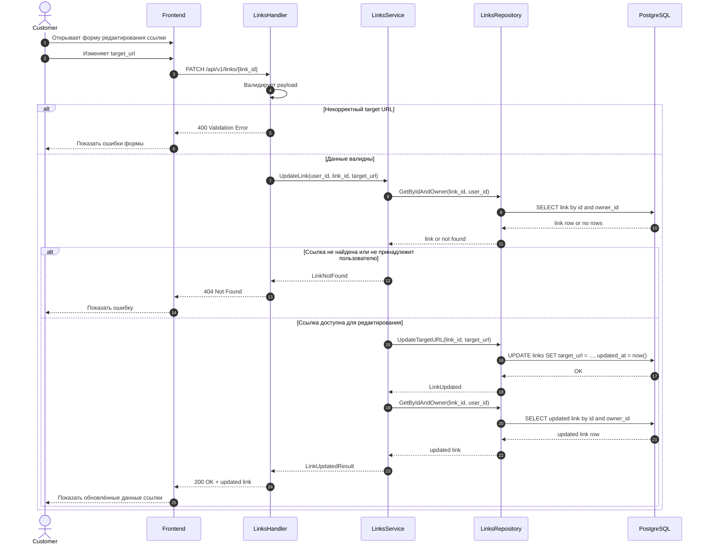

# SD-11 — Редактирование ссылки

```mermaid
sequenceDiagram
    autonumber

    actor Customer
    participant FE as Frontend
    participant LH as LinksHandler
    participant LS as LinksService
    participant LR as LinksRepository
    participant DB as PostgreSQL

    Customer->>FE: Открывает форму редактирования ссылки
    Customer->>FE: Изменяет target_url
    FE->>LH: PATCH /api/v1/links/{link_id}

    LH->>LH: Валидирует payload
    alt Некорректный target URL
        LH-->>FE: 400 Validation Error
        FE-->>Customer: Показать ошибки формы
    else Данные валидны
        LH->>LS: UpdateLink(user_id, link_id, target_url)

        LS->>LR: GetByIdAndOwner(link_id, user_id)
        LR->>DB: SELECT link by id and owner_id
        DB-->>LR: link row or no rows
        LR-->>LS: link or not found

        alt Ссылка не найдена или не принадлежит пользователю
            LS-->>LH: LinkNotFound
            LH-->>FE: 404 Not Found
            FE-->>Customer: Показать ошибку
        else Ссылка доступна для редактирования
            LS->>LR: UpdateTargetURL(link_id, target_url)
            LR->>DB: UPDATE links SET target_url = ..., updated_at = now()
            DB-->>LR: OK
            LR-->>LS: LinkUpdated

            LS->>LR: GetByIdAndOwner(link_id, user_id)
            LR->>DB: SELECT updated link by id and owner_id
            DB-->>LR: updated link row
            LR-->>LS: updated link

            LS-->>LH: LinkUpdatedResult
            LH-->>FE: 200 OK + updated link
            FE-->>Customer: Показать обновлённые данные ссылки
        end
    end
```
