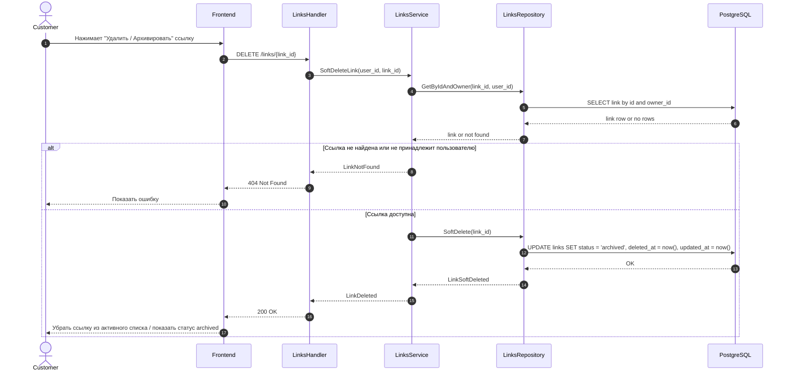

# SD-13 — Soft-delete ссылки

```mermaid
sequenceDiagram
    autonumber

    actor Customer
    participant FE as Frontend
    participant LH as LinksHandler
    participant LS as LinksService
    participant LR as LinksRepository
    participant DB as PostgreSQL

    Customer->>FE: Нажимает "Удалить / Архивировать" ссылку
    FE->>LH: DELETE /links/{link_id}

    LH->>LS: SoftDeleteLink(user_id, link_id)

    LS->>LR: GetByIdAndOwner(link_id, user_id)
    LR->>DB: SELECT link by id and owner_id
    DB-->>LR: link row or no rows
    LR-->>LS: link or not found

    alt Ссылка не найдена или не принадлежит пользователю
        LS-->>LH: LinkNotFound
        LH-->>FE: 404 Not Found
        FE-->>Customer: Показать ошибку
    else Ссылка доступна
        LS->>LR: SoftDelete(link_id)
        LR->>DB: UPDATE links SET status = 'archived', deleted_at = now(), updated_at = now()
        DB-->>LR: OK
        LR-->>LS: LinkSoftDeleted

        LS-->>LH: LinkDeleted
        LH-->>FE: 200 OK
        FE-->>Customer: Убрать ссылку из активного списка / показать статус archived
    end
```
