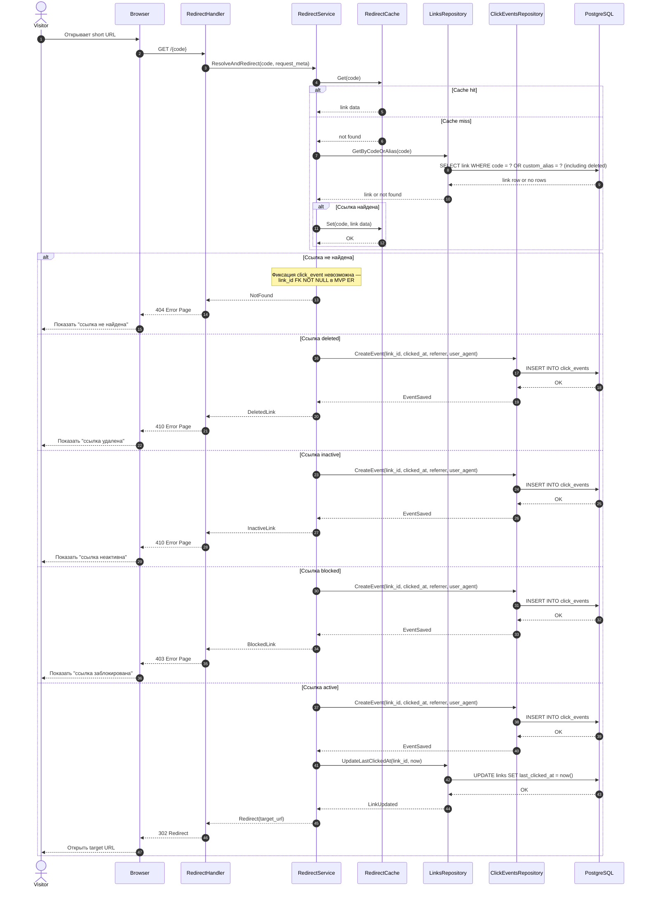

# SD-14 — Открытие short URL и redirect

```mermaid
sequenceDiagram
    autonumber

    actor Visitor
    participant BR as Browser
    participant RH as RedirectHandler
    participant RS as RedirectService
    participant RC as RedirectCache
    participant LR as LinksRepository
    participant CE as ClickEventsRepository
    participant DB as PostgreSQL

    Visitor->>BR: Открывает short URL
    BR->>RH: GET /{code}

    RH->>RS: ResolveAndRedirect(code, request_meta)

    RS->>RC: Get(code)
    alt Cache hit
        RC-->>RS: link data
    else Cache miss
        RC-->>RS: not found
        RS->>LR: GetByCodeOrAlias(code)
        LR->>DB: SELECT link WHERE code = ? OR custom_alias = ? (including deleted)
        DB-->>LR: link row or no rows
        LR-->>RS: link or not found
        alt Ссылка найдена
            RS->>RC: Set(code, link data)
            RC-->>RS: OK
        end
    end

    alt Ссылка не найдена
        note over RS: Фиксация click_event невозможна —<br/>link_id FK NOT NULL в MVP ER
        RS-->>RH: NotFound
        RH-->>BR: 404 Error Page
        BR-->>Visitor: Показать "ссылка не найдена"
    else Ссылка deleted
        RS->>CE: CreateEvent(link_id, clicked_at, referrer, user_agent)
        CE->>DB: INSERT INTO click_events
        DB-->>CE: OK
        CE-->>RS: EventSaved

        RS-->>RH: DeletedLink
        RH-->>BR: 410 Error Page
        BR-->>Visitor: Показать "ссылка удалена"
    else Ссылка inactive
        RS->>CE: CreateEvent(link_id, clicked_at, referrer, user_agent)
        CE->>DB: INSERT INTO click_events
        DB-->>CE: OK
        CE-->>RS: EventSaved

        RS-->>RH: InactiveLink
        RH-->>BR: 410 Error Page
        BR-->>Visitor: Показать "ссылка неактивна"
    else Ссылка blocked
        RS->>CE: CreateEvent(link_id, clicked_at, referrer, user_agent)
        CE->>DB: INSERT INTO click_events
        DB-->>CE: OK
        CE-->>RS: EventSaved

        RS-->>RH: BlockedLink
        RH-->>BR: 403 Error Page
        BR-->>Visitor: Показать "ссылка заблокирована"
    else Ссылка active
        RS->>CE: CreateEvent(link_id, clicked_at, referrer, user_agent)
        CE->>DB: INSERT INTO click_events
        DB-->>CE: OK
        CE-->>RS: EventSaved

        RS->>LR: UpdateLastClickedAt(link_id, now)
        LR->>DB: UPDATE links SET last_clicked_at = now()
        DB-->>LR: OK
        LR-->>RS: LinkUpdated

        RS-->>RH: Redirect(target_url)
        RH-->>BR: 302 Redirect
        BR-->>Visitor: Открыть target URL
    end
```
