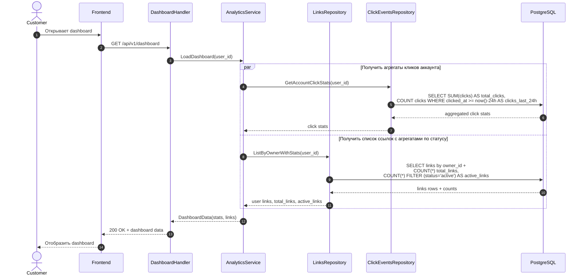

# SD-15 — Загрузка dashboard

```mermaid
sequenceDiagram
    autonumber

    actor Customer
    participant FE as Frontend
    participant DH as DashboardHandler
    participant AS as AnalyticsService
    participant LR as LinksRepository
    participant CR as ClickEventsRepository
    participant DB as PostgreSQL

    Customer->>FE: Открывает dashboard
    FE->>DH: GET /api/v1/dashboard

    DH->>AS: LoadDashboard(user_id)

    par Получить агрегаты кликов аккаунта
        AS->>CR: GetAccountClickStats(user_id)
        CR->>DB: SELECT SUM(clicks) AS total_clicks,<br/>COUNT clicks WHERE clicked_at >= now()-24h AS clicks_last_24h
        DB-->>CR: aggregated click stats
        CR-->>AS: click stats
    and Получить список ссылок с агрегатами по статусу
        AS->>LR: ListByOwnerWithStats(user_id)
        LR->>DB: SELECT links by owner_id +<br/>COUNT(*) total_links,<br/>COUNT(*) FILTER (status='active') AS active_links
        DB-->>LR: links rows + counts
        LR-->>AS: user links, total_links, active_links
    end

    AS-->>DH: DashboardData(stats, links)
    DH-->>FE: 200 OK + dashboard data
    FE-->>Customer: Отобразить dashboard
```
