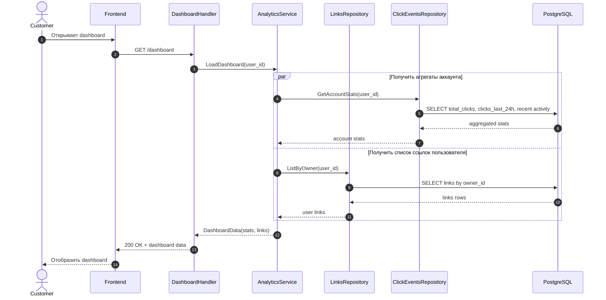

# SD-15 — Загрузка dashboard

```mermaid
sequenceDiagram
    autonumber

    actor Customer
    participant FE as Frontend
    participant DH as DashboardHandler
    participant AS as AnalyticsService
    participant LR as LinksRepository
    participant CR as ClickEventsRepository
    participant DB as PostgreSQL

    Customer->>FE: Открывает dashboard
    FE->>DH: GET /dashboard

    DH->>AS: LoadDashboard(user_id)

    par Получить агрегаты аккаунта
        AS->>CR: GetAccountStats(user_id)
        CR->>DB: SELECT total_clicks, clicks_last_24h, recent activity
        DB-->>CR: aggregated stats
        CR-->>AS: account stats
    and Получить список ссылок пользователя
        AS->>LR: ListByOwner(user_id)
        LR->>DB: SELECT links by owner_id
        DB-->>LR: links rows
        LR-->>AS: user links
    end

    AS-->>DH: DashboardData(stats, links)
    DH-->>FE: 200 OK + dashboard data
    FE-->>Customer: Отобразить dashboard
```
