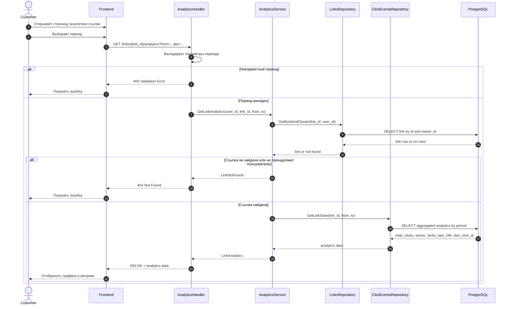

# SD-16 — Получение аналитики по ссылке за период

```mermaid
sequenceDiagram
    autonumber

    actor Customer
    participant FE as Frontend
    participant AH as AnalyticsHandler
    participant AS as AnalyticsService
    participant LR as LinksRepository
    participant CR as ClickEventsRepository
    participant DB as PostgreSQL

    Customer->>FE: Открывает страницу аналитики ссылки
    Customer->>FE: Выбирает период
    FE->>AH: GET /links/{link_id}/analytics?from=...&to=...

    AH->>AH: Валидирует параметры периода
    alt Некорректный период
        AH-->>FE: 400 Validation Error
        FE-->>Customer: Показать ошибку
    else Период валиден
        AH->>AS: GetLinkAnalytics(user_id, link_id, from, to)

        AS->>LR: GetByIdAndOwner(link_id, user_id)
        LR->>DB: SELECT link by id and owner_id
        DB-->>LR: link row or no rows
        LR-->>AS: link or not found

        alt Ссылка не найдена или не принадлежит пользователю
            AS-->>AH: LinkNotFound
            AH-->>FE: 404 Not Found
            FE-->>Customer: Показать ошибку
        else Ссылка найдена
            AS->>CR: GetLinkStats(link_id, from, to)
            CR->>DB: SELECT aggregated analytics by period
            DB-->>CR: total_clicks, series, clicks_last_24h, last_click_at
            CR-->>AS: analytics data

            AS-->>AH: LinkAnalytics
            AH-->>FE: 200 OK + analytics data
            FE-->>Customer: Отобразить графики и метрики
        end
    end
```
