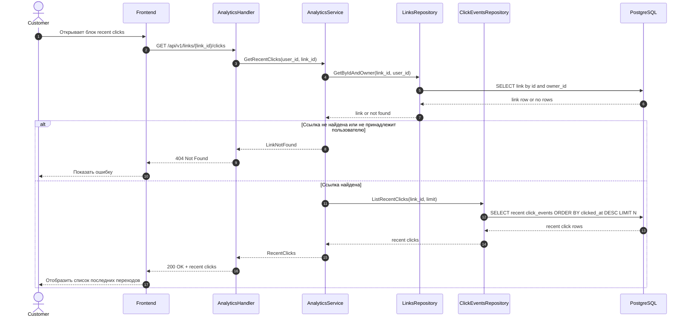

# SD-17 — Получение последних переходов

```mermaid
sequenceDiagram
    autonumber

    actor Customer
    participant FE as Frontend
    participant AH as AnalyticsHandler
    participant AS as AnalyticsService
    participant LR as LinksRepository
    participant CR as ClickEventsRepository
    participant DB as PostgreSQL

    Customer->>FE: Открывает блок recent clicks
    FE->>AH: GET /api/v1/links/{link_id}/clicks

    AH->>AS: GetRecentClicks(user_id, link_id)

    AS->>LR: GetByIdAndOwner(link_id, user_id)
    LR->>DB: SELECT link by id and owner_id
    DB-->>LR: link row or no rows
    LR-->>AS: link or not found

    alt Ссылка не найдена или не принадлежит пользователю
        AS-->>AH: LinkNotFound
        AH-->>FE: 404 Not Found
        FE-->>Customer: Показать ошибку
    else Ссылка найдена
        AS->>CR: ListRecentClicks(link_id, limit)
        CR->>DB: SELECT recent click_events ORDER BY clicked_at DESC LIMIT N
        DB-->>CR: recent click rows
        CR-->>AS: recent clicks

        AS-->>AH: RecentClicks
        AH-->>FE: 200 OK + recent clicks
        FE-->>Customer: Отобразить список последних переходов
    end
```
