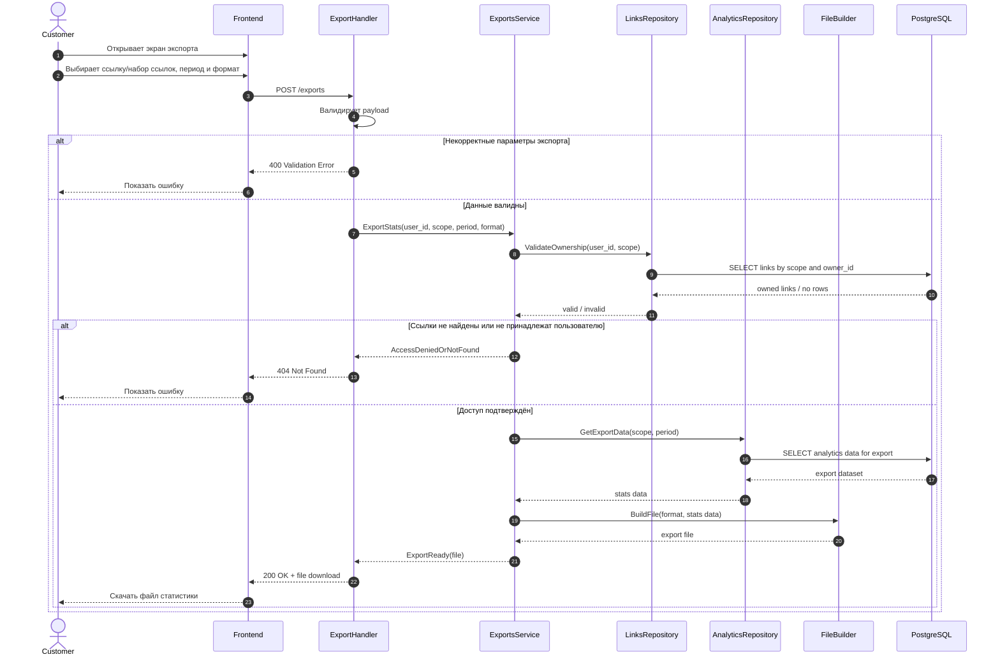

# SD-18 — Экспорт статистики

```mermaid
sequenceDiagram
    autonumber

    actor Customer
    participant FE as Frontend
    participant EH as ExportHandler
    participant ES as ExportsService
    participant LR as LinksRepository
    participant AR as AnalyticsRepository
    participant FB as FileBuilder
    participant DB as PostgreSQL

    Customer->>FE: Открывает экран экспорта
    Customer->>FE: Выбирает ссылку/набор ссылок, период и формат
    FE->>EH: POST /exports

    EH->>EH: Валидирует payload
    alt Некорректные параметры экспорта
        EH-->>FE: 400 Validation Error
        FE-->>Customer: Показать ошибку
    else Данные валидны
        EH->>ES: ExportStats(user_id, scope, period, format)

        ES->>LR: ValidateOwnership(user_id, scope)
        LR->>DB: SELECT links by scope and owner_id
        DB-->>LR: owned links / no rows
        LR-->>ES: valid / invalid

        alt Ссылки не найдены или не принадлежат пользователю
            ES-->>EH: AccessDeniedOrNotFound
            EH-->>FE: 404 Not Found
            FE-->>Customer: Показать ошибку
        else Доступ подтверждён
            ES->>AR: GetExportData(scope, period)
            AR->>DB: SELECT analytics data for export
            DB-->>AR: export dataset
            AR-->>ES: stats data

            ES->>FB: BuildFile(format, stats data)
            FB-->>ES: export file

            ES-->>EH: ExportReady(file)
            EH-->>FE: 200 OK + file download
            FE-->>Customer: Скачать файл статистики
        end
    end
```
