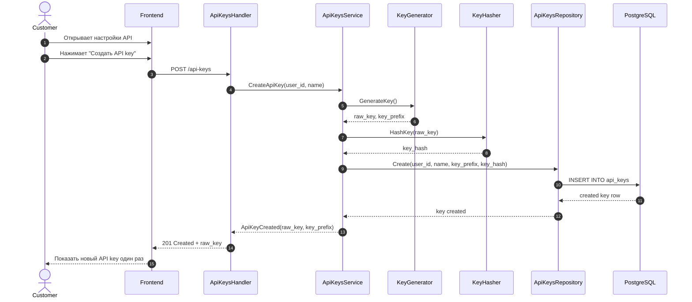

# SD-19 — Создать API key

> **Scope: Full version — не входит в MVP**

```mermaid
sequenceDiagram
    autonumber

    actor Customer
    participant FE as Frontend
    participant AH as ApiKeysHandler
    participant AK as ApiKeysService
    participant KG as KeyGenerator
    participant KH as KeyHasher
    participant KR as ApiKeysRepository
    participant DB as PostgreSQL

    Customer->>FE: Открывает настройки API
    Customer->>FE: Нажимает "Создать API key"
    FE->>AH: POST /api-keys

    AH->>AK: CreateApiKey(user_id, name)

    AK->>KG: GenerateKey()
    KG-->>AK: raw_key, key_prefix

    AK->>KH: HashKey(raw_key)
    KH-->>AK: key_hash

    AK->>KR: Create(user_id, name, key_prefix, key_hash)
    KR->>DB: INSERT INTO api_keys
    DB-->>KR: created key row
    KR-->>AK: key created

    AK-->>AH: ApiKeyCreated(raw_key, key_prefix)
    AH-->>FE: 201 Created + raw_key
    FE-->>Customer: Показать новый API key один раз
```
