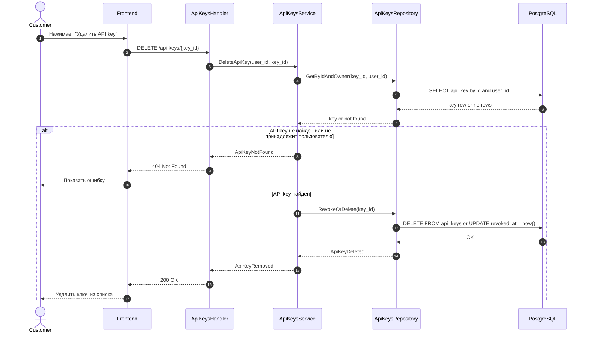

# SD-20 — Удалить API key

> **Scope: Full version — не входит в MVP**

```mermaid
sequenceDiagram
    autonumber

    actor Customer
    participant FE as Frontend
    participant AH as ApiKeysHandler
    participant AK as ApiKeysService
    participant KR as ApiKeysRepository
    participant DB as PostgreSQL

    Customer->>FE: Нажимает "Удалить API key"
    FE->>AH: DELETE /api-keys/{key_id}

    AH->>AK: DeleteApiKey(user_id, key_id)

    AK->>KR: GetByIdAndOwner(key_id, user_id)
    KR->>DB: SELECT api_key by id and user_id
    DB-->>KR: key row or no rows
    KR-->>AK: key or not found

    alt API key не найден или не принадлежит пользователю
        AK-->>AH: ApiKeyNotFound
        AH-->>FE: 404 Not Found
        FE-->>Customer: Показать ошибку
    else API key найден
        AK->>KR: RevokeOrDelete(key_id)
        KR->>DB: DELETE FROM api_keys or UPDATE revoked_at = now()
        DB-->>KR: OK
        KR-->>AK: ApiKeyDeleted

        AK-->>AH: ApiKeyRemoved
        AH-->>FE: 200 OK
        FE-->>Customer: Удалить ключ из списка
    end
```
