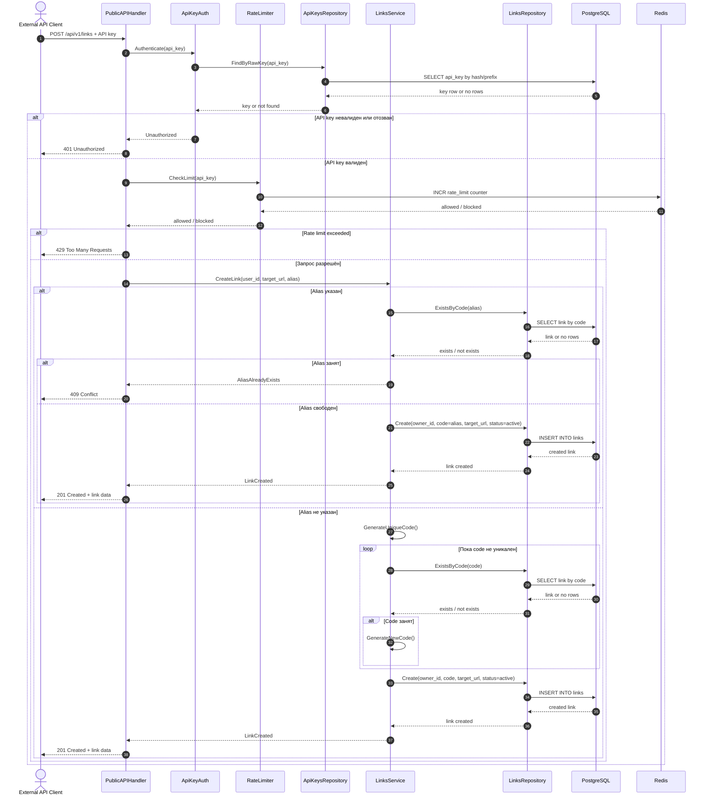

# SD-21 — API: создать ссылку

> **Scope: Full version — не входит в MVP**

```mermaid
sequenceDiagram
    autonumber

    actor Client as External API Client
    participant API as PublicAPIHandler
    participant AA as ApiKeyAuth
    participant RL as RateLimiter
    participant KR as ApiKeysRepository
    participant LS as LinksService
    participant LR as LinksRepository
    participant DB as PostgreSQL
    participant RD as Redis

    Client->>API: POST /api/v1/links + API key
    API->>AA: Authenticate(api_key)

    AA->>KR: FindByRawKey(api_key)
    KR->>DB: SELECT api_key by hash/prefix
    DB-->>KR: key row or no rows
    KR-->>AA: key or not found

    alt API key невалиден или отозван
        AA-->>API: Unauthorized
        API-->>Client: 401 Unauthorized
    else API key валиден
        API->>RL: CheckLimit(api_key)
        RL->>RD: INCR rate_limit counter
        RD-->>RL: allowed / blocked
        RL-->>API: allowed / blocked

        alt Rate limit exceeded
            API-->>Client: 429 Too Many Requests
        else Запрос разрешён
            API->>LS: CreateLink(user_id, target_url, alias)

            alt Alias указан
                LS->>LR: ExistsByCode(alias)
                LR->>DB: SELECT link by code
                DB-->>LR: link or no rows
                LR-->>LS: exists / not exists

                alt Alias занят
                    LS-->>API: AliasAlreadyExists
                    API-->>Client: 409 Conflict
                else Alias свободен
                    LS->>LR: Create(owner_id, code=alias, target_url, status=active)
                    LR->>DB: INSERT INTO links
                    DB-->>LR: created link
                    LR-->>LS: link created

                    LS-->>API: LinkCreated
                    API-->>Client: 201 Created + link data
                end
            else Alias не указан
                LS->>LS: GenerateUniqueCode()
                loop Пока code не уникален
                    LS->>LR: ExistsByCode(code)
                    LR->>DB: SELECT link by code
                    DB-->>LR: link or no rows
                    LR-->>LS: exists / not exists
                    alt Code занят
                        LS->>LS: GenerateNewCode()
                    end
                end

                LS->>LR: Create(owner_id, code, target_url, status=active)
                LR->>DB: INSERT INTO links
                DB-->>LR: created link
                LR-->>LS: link created

                LS-->>API: LinkCreated
                API-->>Client: 201 Created + link data
            end
        end
    end
```
