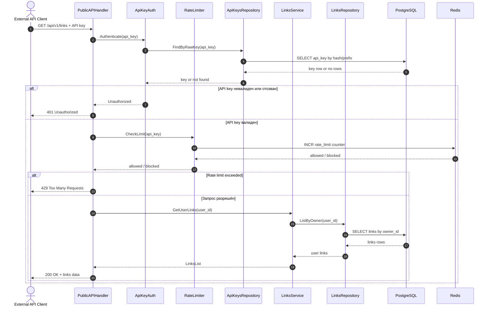

# SD-22 — API: получить список ссылок

```mermaid
sequenceDiagram
    autonumber

    actor Client as External API Client
    participant API as PublicAPIHandler
    participant AA as ApiKeyAuth
    participant RL as RateLimiter
    participant KR as ApiKeysRepository
    participant LS as LinksService
    participant LR as LinksRepository
    participant DB as PostgreSQL
    participant RD as Redis

    Client->>API: GET /api/v1/links + API key
    API->>AA: Authenticate(api_key)

    AA->>KR: FindByRawKey(api_key)
    KR->>DB: SELECT api_key by hash/prefix
    DB-->>KR: key row or no rows
    KR-->>AA: key or not found

    alt API key невалиден или отозван
        AA-->>API: Unauthorized
        API-->>Client: 401 Unauthorized
    else API key валиден
        API->>RL: CheckLimit(api_key)
        RL->>RD: INCR rate_limit counter
        RD-->>RL: allowed / blocked
        RL-->>API: allowed / blocked

        alt Rate limit exceeded
            API-->>Client: 429 Too Many Requests
        else Запрос разрешён
            API->>LS: GetUserLinks(user_id)
            LS->>LR: ListByOwner(user_id)
            LR->>DB: SELECT links by owner_id
            DB-->>LR: links rows
            LR-->>LS: user links

            LS-->>API: LinksList
            API-->>Client: 200 OK + links data
        end
    end
```
