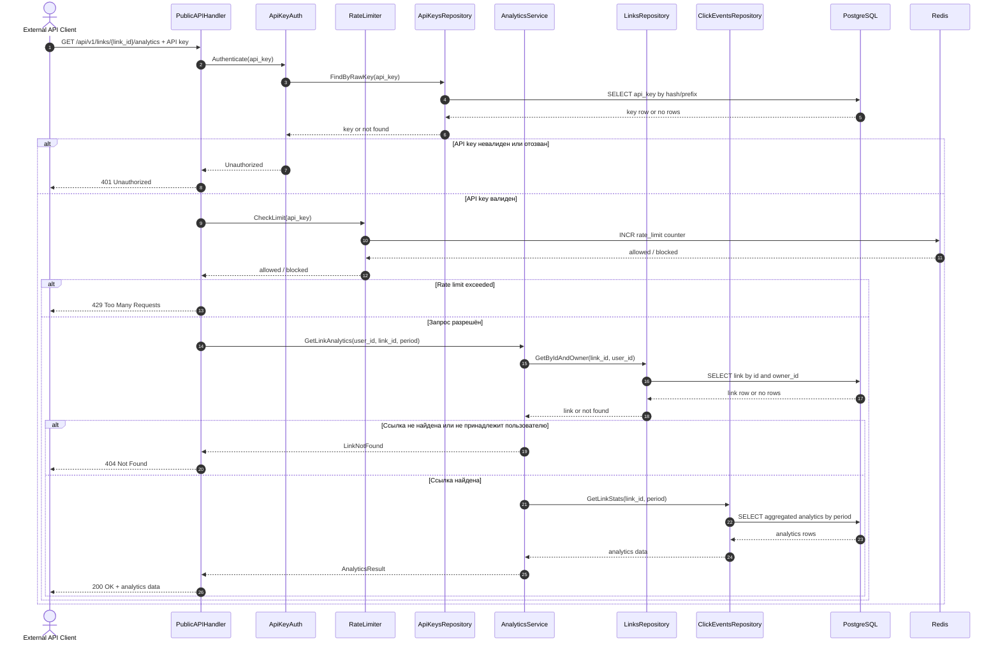

# SD-24 — API: получить статистику

> **Scope: Full version — не входит в MVP**

```mermaid
sequenceDiagram
    autonumber

    actor Client as External API Client
    participant API as PublicAPIHandler
    participant AA as ApiKeyAuth
    participant RL as RateLimiter
    participant KR as ApiKeysRepository
    participant AS as AnalyticsService
    participant LR as LinksRepository
    participant CR as ClickEventsRepository
    participant DB as PostgreSQL
    participant RD as Redis

    Client->>API: GET /api/v1/links/{link_id}/analytics + API key
    API->>AA: Authenticate(api_key)

    AA->>KR: FindByRawKey(api_key)
    KR->>DB: SELECT api_key by hash/prefix
    DB-->>KR: key row or no rows
    KR-->>AA: key or not found

    alt API key невалиден или отозван
        AA-->>API: Unauthorized
        API-->>Client: 401 Unauthorized
    else API key валиден
        API->>RL: CheckLimit(api_key)
        RL->>RD: INCR rate_limit counter
        RD-->>RL: allowed / blocked
        RL-->>API: allowed / blocked

        alt Rate limit exceeded
            API-->>Client: 429 Too Many Requests
        else Запрос разрешён
            API->>AS: GetLinkAnalytics(user_id, link_id, period)

            AS->>LR: GetByIdAndOwner(link_id, user_id)
            LR->>DB: SELECT link by id and owner_id
            DB-->>LR: link row or no rows
            LR-->>AS: link or not found

            alt Ссылка не найдена или не принадлежит пользователю
                AS-->>API: LinkNotFound
                API-->>Client: 404 Not Found
            else Ссылка найдена
                AS->>CR: GetLinkStats(link_id, period)
                CR->>DB: SELECT aggregated analytics by period
                DB-->>CR: analytics rows
                CR-->>AS: analytics data

                AS-->>API: AnalyticsResult
                API-->>Client: 200 OK + analytics data
            end
        end
    end
```
