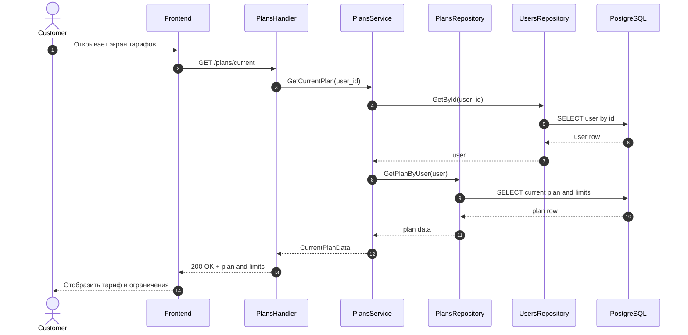

# SD-25 — Получение тарифа и лимитов

```mermaid
sequenceDiagram
    autonumber

    actor Customer
    participant FE as Frontend
    participant PH as PlansHandler
    participant PS as PlansService
    participant PR as PlansRepository
    participant UR as UsersRepository
    participant DB as PostgreSQL

    Customer->>FE: Открывает экран тарифов
    FE->>PH: GET /plans/current

    PH->>PS: GetCurrentPlan(user_id)

    PS->>UR: GetById(user_id)
    UR->>DB: SELECT user by id
    DB-->>UR: user row
    UR-->>PS: user

    PS->>PR: GetPlanByUser(user)
    PR->>DB: SELECT current plan and limits
    DB-->>PR: plan row
    PR-->>PS: plan data

    PS-->>PH: CurrentPlanData
    PH-->>FE: 200 OK + plan and limits
    FE-->>Customer: Отобразить тариф и ограничения
```
