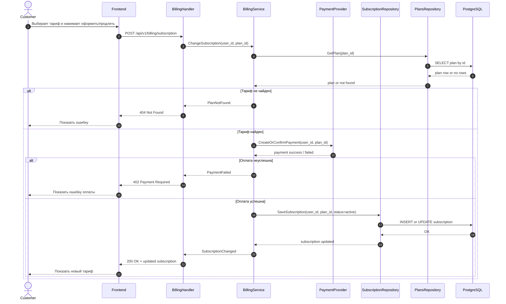

# SD-26 — Оформление / продление подписки

> **Scope: Full version — не входит в MVP**

```mermaid
sequenceDiagram
    autonumber

    actor Customer
    participant FE as Frontend
    participant BH as BillingHandler
    participant BS as BillingService
    participant PP as PaymentProvider
    participant SR as SubscriptionRepository
    participant PR as PlansRepository
    participant DB as PostgreSQL

    Customer->>FE: Выбирает тариф и нажимает оформить/продлить
    FE->>BH: POST /api/v1/billing/subscription

    BH->>BS: ChangeSubscription(user_id, plan_id)

    BS->>PR: GetPlan(plan_id)
    PR->>DB: SELECT plan by id
    DB-->>PR: plan row or no rows
    PR-->>BS: plan or not found

    alt Тариф не найден
        BS-->>BH: PlanNotFound
        BH-->>FE: 404 Not Found
        FE-->>Customer: Показать ошибку
    else Тариф найден
        BS->>PP: CreateOrConfirmPayment(user_id, plan_id)
        PP-->>BS: payment success / failed

        alt Оплата неуспешна
            BS-->>BH: PaymentFailed
            BH-->>FE: 402 Payment Required
            FE-->>Customer: Показать ошибку оплаты
        else Оплата успешна
            BS->>SR: SaveSubscription(user_id, plan_id, status=active)
            SR->>DB: INSERT or UPDATE subscription
            DB-->>SR: OK
            SR-->>BS: subscription updated

            BS-->>BH: SubscriptionChanged
            BH-->>FE: 200 OK + updated subscription
            FE-->>Customer: Показать новый тариф
        end
    end
```
