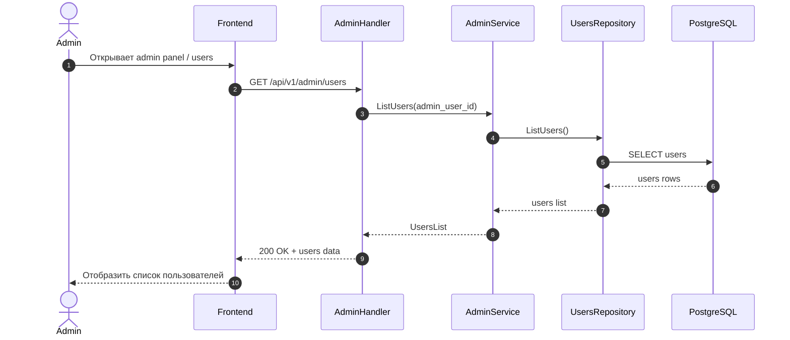

# SD-27 — Получение списка пользователей

> **Scope: Full version — не входит в MVP**

```mermaid
sequenceDiagram
    autonumber

    actor Admin
    participant FE as Frontend
    participant ADH as AdminHandler
    participant ADS as AdminService
    participant UR as UsersRepository
    participant DB as PostgreSQL

    Admin->>FE: Открывает admin panel / users
    FE->>ADH: GET /api/v1/admin/users

    ADH->>ADS: ListUsers(admin_user_id)

    ADS->>UR: ListUsers()
    UR->>DB: SELECT users
    DB-->>UR: users rows
    UR-->>ADS: users list

    ADS-->>ADH: UsersList
    ADH-->>FE: 200 OK + users data
    FE-->>Admin: Отобразить список пользователей
```
