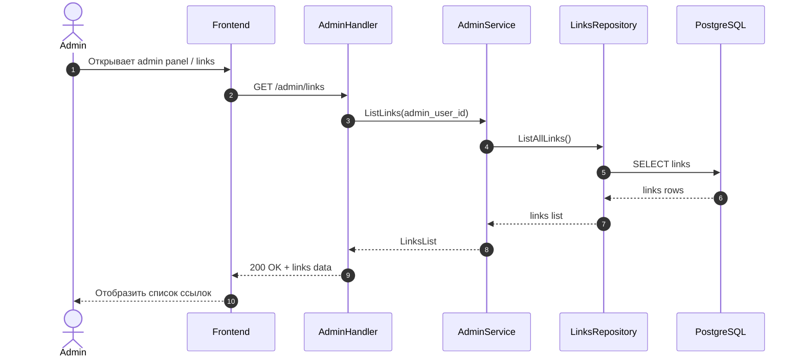

# SD-28 — Получение списка ссылок

```mermaid
sequenceDiagram
    autonumber

    actor Admin
    participant FE as Frontend
    participant ADH as AdminHandler
    participant ADS as AdminService
    participant LR as LinksRepository
    participant DB as PostgreSQL

    Admin->>FE: Открывает admin panel / links
    FE->>ADH: GET /admin/links

    ADH->>ADS: ListLinks(admin_user_id)

    ADS->>LR: ListAllLinks()
    LR->>DB: SELECT links
    DB-->>LR: links rows
    LR-->>ADS: links list

    ADS-->>ADH: LinksList
    ADH-->>FE: 200 OK + links data
    FE-->>Admin: Отобразить список ссылок
```
