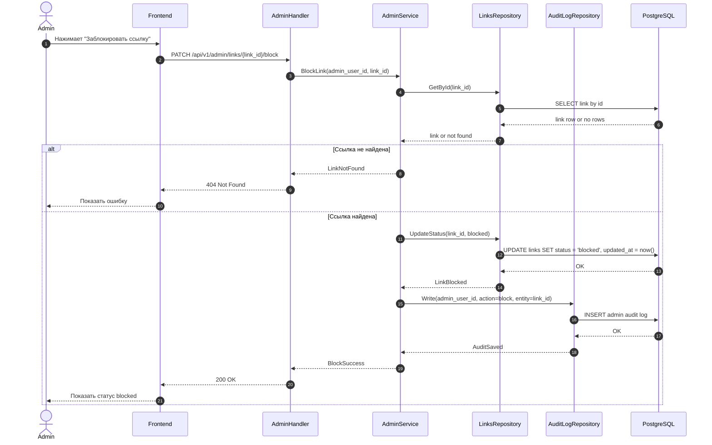

# SD-29 — Блокировка ссылки

```mermaid
sequenceDiagram
    autonumber

    actor Admin
    participant FE as Frontend
    participant ADH as AdminHandler
    participant ADS as AdminService
    participant LR as LinksRepository
    participant AL as AuditLogRepository
    participant DB as PostgreSQL

    Admin->>FE: Нажимает "Заблокировать ссылку"
    FE->>ADH: PATCH /api/v1/admin/links/{link_id}/block

    ADH->>ADS: BlockLink(admin_user_id, link_id)

    ADS->>LR: GetById(link_id)
    LR->>DB: SELECT link by id
    DB-->>LR: link row or no rows
    LR-->>ADS: link or not found

    alt Ссылка не найдена
        ADS-->>ADH: LinkNotFound
        ADH-->>FE: 404 Not Found
        FE-->>Admin: Показать ошибку
    else Ссылка найдена
        ADS->>LR: UpdateStatus(link_id, blocked)
        LR->>DB: UPDATE links SET status = 'blocked', updated_at = now()
        DB-->>LR: OK
        LR-->>ADS: LinkBlocked

        ADS->>AL: Write(admin_user_id, action=block, entity=link_id)
        AL->>DB: INSERT admin audit log
        DB-->>AL: OK
        AL-->>ADS: AuditSaved

        ADS-->>ADH: BlockSuccess
        ADH-->>FE: 200 OK
        FE-->>Admin: Показать статус blocked
    end
```
