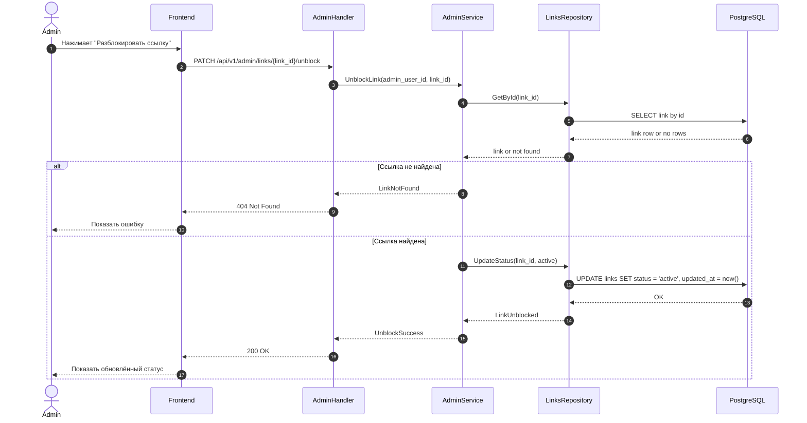

# SD-30 — Разблокировка ссылки

```mermaid
sequenceDiagram
    autonumber

    actor Admin
    participant FE as Frontend
    participant ADH as AdminHandler
    participant ADS as AdminService
    participant LR as LinksRepository
    participant DB as PostgreSQL

    Admin->>FE: Нажимает "Разблокировать ссылку"
    FE->>ADH: PATCH /api/v1/admin/links/{link_id}/unblock

    ADH->>ADS: UnblockLink(admin_user_id, link_id)

    ADS->>LR: GetById(link_id)
    LR->>DB: SELECT link by id
    DB-->>LR: link row or no rows
    LR-->>ADS: link or not found

    alt Ссылка не найдена
        ADS-->>ADH: LinkNotFound
        ADH-->>FE: 404 Not Found
        FE-->>Admin: Показать ошибку
    else Ссылка найдена
        ADS->>LR: UpdateStatus(link_id, active)
        LR->>DB: UPDATE links SET status = 'active', updated_at = now()
        DB-->>LR: OK
        LR-->>ADS: LinkUnblocked

        ADS-->>ADH: UnblockSuccess
        ADH-->>FE: 200 OK
        FE-->>Admin: Показать обновлённый статус
    end
```
