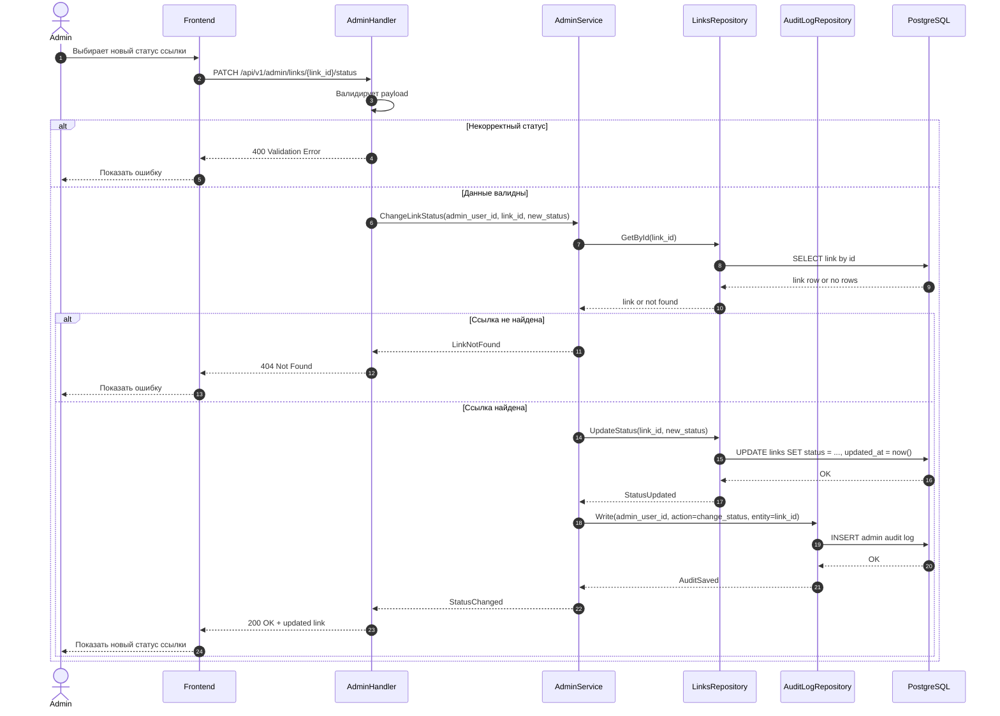

# SD-31 — Изменение статуса ссылки администратором

> **Scope: Full version / COULD — не входит в MVP** (FR-150 COULD)

```mermaid
sequenceDiagram
    autonumber

    actor Admin
    participant FE as Frontend
    participant ADH as AdminHandler
    participant ADS as AdminService
    participant LR as LinksRepository
    participant AL as AuditLogRepository
    participant DB as PostgreSQL

    Admin->>FE: Выбирает новый статус ссылки
    FE->>ADH: PATCH /api/v1/admin/links/{link_id}/status

    ADH->>ADH: Валидирует payload
    alt Некорректный статус
        ADH-->>FE: 400 Validation Error
        FE-->>Admin: Показать ошибку
    else Данные валидны
        ADH->>ADS: ChangeLinkStatus(admin_user_id, link_id, new_status)

        ADS->>LR: GetById(link_id)
        LR->>DB: SELECT link by id
        DB-->>LR: link row or no rows
        LR-->>ADS: link or not found

        alt Ссылка не найдена
            ADS-->>ADH: LinkNotFound
            ADH-->>FE: 404 Not Found
            FE-->>Admin: Показать ошибку
        else Ссылка найдена
            ADS->>LR: UpdateStatus(link_id, new_status)
            LR->>DB: UPDATE links SET status = ..., updated_at = now()
            DB-->>LR: OK
            LR-->>ADS: StatusUpdated

            ADS->>AL: Write(admin_user_id, action=change_status, entity=link_id)
            AL->>DB: INSERT admin audit log
            DB-->>AL: OK
            AL-->>ADS: AuditSaved

            ADS-->>ADH: StatusChanged
            ADH-->>FE: 200 OK + updated link
            FE-->>Admin: Показать новый статус ссылки
        end
    end
```
