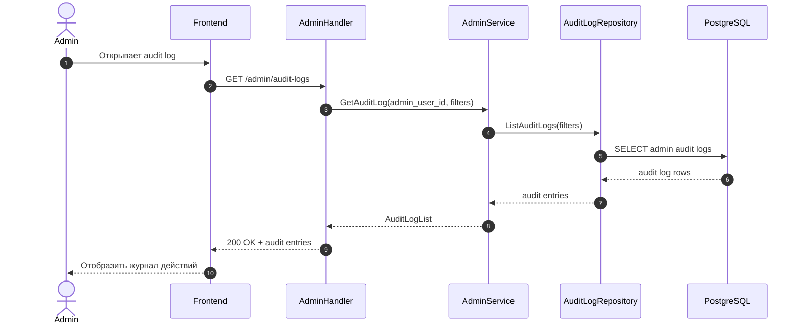

# SD-32 — Просмотр audit log

```mermaid
sequenceDiagram
    autonumber

    actor Admin
    participant FE as Frontend
    participant ADH as AdminHandler
    participant ADS as AdminService
    participant AL as AuditLogRepository
    participant DB as PostgreSQL

    Admin->>FE: Открывает audit log
    FE->>ADH: GET /admin/audit-logs

    ADH->>ADS: GetAuditLog(admin_user_id, filters)

    ADS->>AL: ListAuditLogs(filters)
    AL->>DB: SELECT admin audit logs
    DB-->>AL: audit log rows
    AL-->>ADS: audit entries

    ADS-->>ADH: AuditLogList
    ADH-->>FE: 200 OK + audit entries
    FE-->>Admin: Отобразить журнал действий
```
