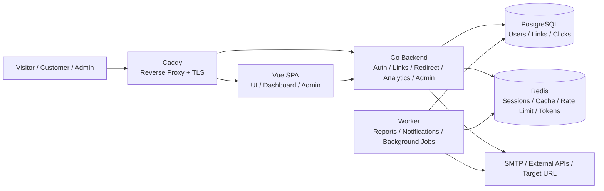
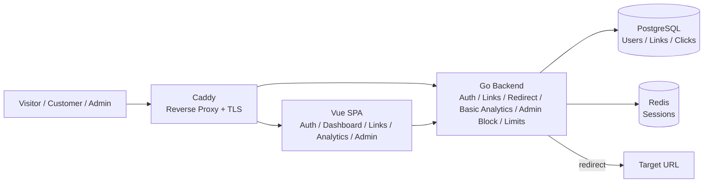

# Архитектура

## Full

```mermaid
flowchart LR
    User[Visitor / Customer / Admin]
    Caddy[Caddy<br/>Reverse Proxy + TLS]
    Frontend[Vue SPA<br/>UI / Dashboard / Admin]
    Backend[Go Backend<br/>Auth / Links / Redirect / Analytics / Admin]
    Postgres[(PostgreSQL<br/>Users / Links / Clicks)]
    Redis[(Redis<br/>Sessions / Cache / Rate Limit / Tokens)]
    Worker[Worker<br/>Reports / Notifications / Background Jobs]
    External[SMTP / External APIs / Target URL]

    User --> Caddy
    Caddy --> Frontend
    Caddy --> Backend

    Frontend --> Backend

    Backend --> Postgres
    Backend --> Redis
    Backend --> External

    Worker --> Redis
    Worker --> Postgres
    Worker --> External
```

## MVP

```mermaid
flowchart LR
    User[Visitor / Customer / Admin]
    Caddy[Caddy<br/>Reverse Proxy + TLS]
    Frontend[Vue SPA<br/>Auth / Dashboard / Links / Analytics / Admin]
    Backend[Go Backend<br/>Auth / Links / Redirect / Basic Analytics / Admin Block / Limits]
    Postgres[(PostgreSQL<br/>Users / Links / Clicks)]
    Redis[(Redis<br/>Sessions)]
    Target[Target URL]

    User --> Caddy
    Caddy --> Frontend
    Caddy --> Backend

    Frontend --> Backend

    Backend --> Postgres
    Backend --> Redis
    Backend -->|redirect| Target
```

