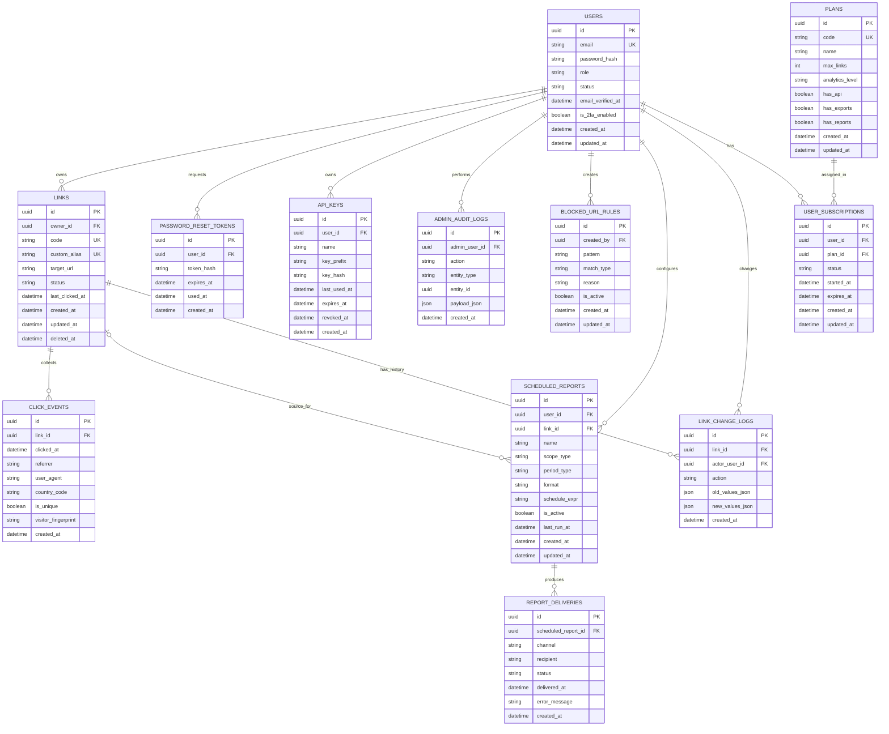
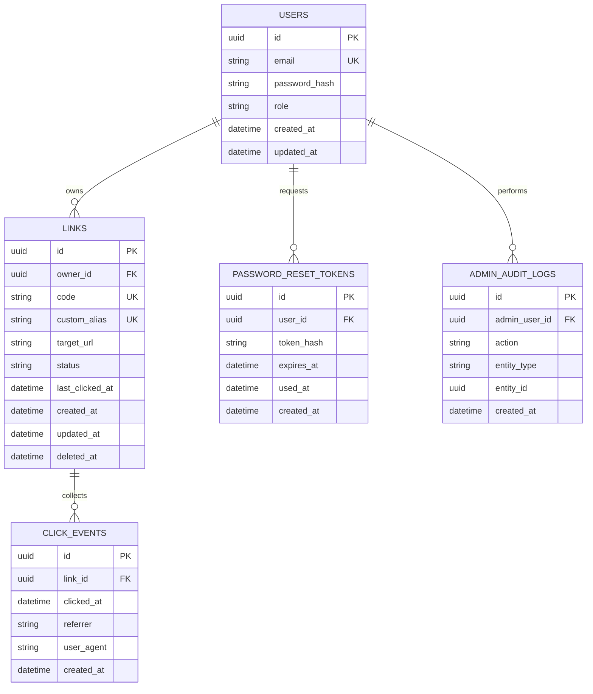

## ER-Диаграмма

```mermaid
erDiagram
    USERS {
        uuid id PK
        string email UK
        string password_hash
        string role
        string status
        datetime email_verified_at
        boolean is_2fa_enabled
        datetime created_at
        datetime updated_at
    }

    LINKS {
        uuid id PK
        uuid owner_id FK
        string code UK
        string custom_alias UK
        string target_url
        string status
        datetime last_clicked_at
        datetime created_at
        datetime updated_at
        datetime deleted_at
    }

    CLICK_EVENTS {
        uuid id PK
        uuid link_id FK
        datetime clicked_at
        string referrer
        string user_agent
        string country_code
        boolean is_unique
        string visitor_fingerprint
        datetime created_at
    }

    PASSWORD_RESET_TOKENS {
        uuid id PK
        uuid user_id FK
        string token_hash
        datetime expires_at
        datetime used_at
        datetime created_at
    }

    ADMIN_AUDIT_LOGS {
        uuid id PK
        uuid admin_user_id FK
        string action
        string entity_type
        uuid entity_id
        json payload_json
        datetime created_at
    }

    API_KEYS {
        uuid id PK
        uuid user_id FK
        string name
        string key_prefix
        string key_hash
        datetime last_used_at
        datetime expires_at
        datetime revoked_at
        datetime created_at
    }

    BLOCKED_URL_RULES {
        uuid id PK
        uuid created_by FK
        string pattern
        string match_type
        string reason
        boolean is_active
        datetime created_at
        datetime updated_at
    }

    SCHEDULED_REPORTS {
        uuid id PK
        uuid user_id FK
        uuid link_id FK
        string name
        string scope_type
        string period_type
        string format
        string schedule_expr
        boolean is_active
        datetime last_run_at
        datetime created_at
        datetime updated_at
    }

    REPORT_DELIVERIES {
        uuid id PK
        uuid scheduled_report_id FK
        string channel
        string recipient
        string status
        datetime delivered_at
        string error_message
        datetime created_at
    }

    LINK_CHANGE_LOGS {
        uuid id PK
        uuid link_id FK
        uuid actor_user_id FK
        string action
        json old_values_json
        json new_values_json
        datetime created_at
    }

    PLANS {
        uuid id PK
        string code UK
        string name
        int max_links
        string analytics_level
        boolean has_api
        boolean has_exports
        boolean has_reports
        datetime created_at
        datetime updated_at
    }

    USER_SUBSCRIPTIONS {
        uuid id PK
        uuid user_id FK
        uuid plan_id FK
        string status
        datetime started_at
        datetime expires_at
        datetime created_at
        datetime updated_at
    }

    USERS ||--o{ LINKS : owns
    LINKS ||--o{ CLICK_EVENTS : collects

    USERS ||--o{ PASSWORD_RESET_TOKENS : requests
    USERS ||--o{ API_KEYS : owns

    USERS ||--o{ ADMIN_AUDIT_LOGS : performs
    USERS ||--o{ BLOCKED_URL_RULES : creates

    USERS ||--o{ SCHEDULED_REPORTS : configures
    LINKS o|--o{ SCHEDULED_REPORTS : source_for
    SCHEDULED_REPORTS ||--o{ REPORT_DELIVERIES : produces

    LINKS ||--o{ LINK_CHANGE_LOGS : has_history
    USERS ||--o{ LINK_CHANGE_LOGS : changes

    PLANS ||--o{ USER_SUBSCRIPTIONS : assigned_in
    USERS ||--o{ USER_SUBSCRIPTIONS : has
```

## MVP

```mermaid

erDiagram
    USERS {
        uuid id PK
        string email UK
        string password_hash
        string role
        datetime created_at
        datetime updated_at
    }

    LINKS {
        uuid id PK
        uuid owner_id FK
        string code UK
        string custom_alias UK
        string target_url
        string status
        datetime last_clicked_at
        datetime created_at
        datetime updated_at
        datetime deleted_at
    }

    CLICK_EVENTS {
        uuid id PK
        uuid link_id FK
        datetime clicked_at
        string referrer
        string user_agent
        datetime created_at
    }

    PASSWORD_RESET_TOKENS {
        uuid id PK
        uuid user_id FK
        string token_hash
        datetime expires_at
        datetime used_at
        datetime created_at
    }

    ADMIN_AUDIT_LOGS {
        uuid id PK
        uuid admin_user_id FK
        string action
        string entity_type
        uuid entity_id
        datetime created_at
    }

    USERS ||--o{ LINKS : owns
    LINKS ||--o{ CLICK_EVENTS : collects
    USERS ||--o{ PASSWORD_RESET_TOKENS : requests
    USERS ||--o{ ADMIN_AUDIT_LOGS : performs

```